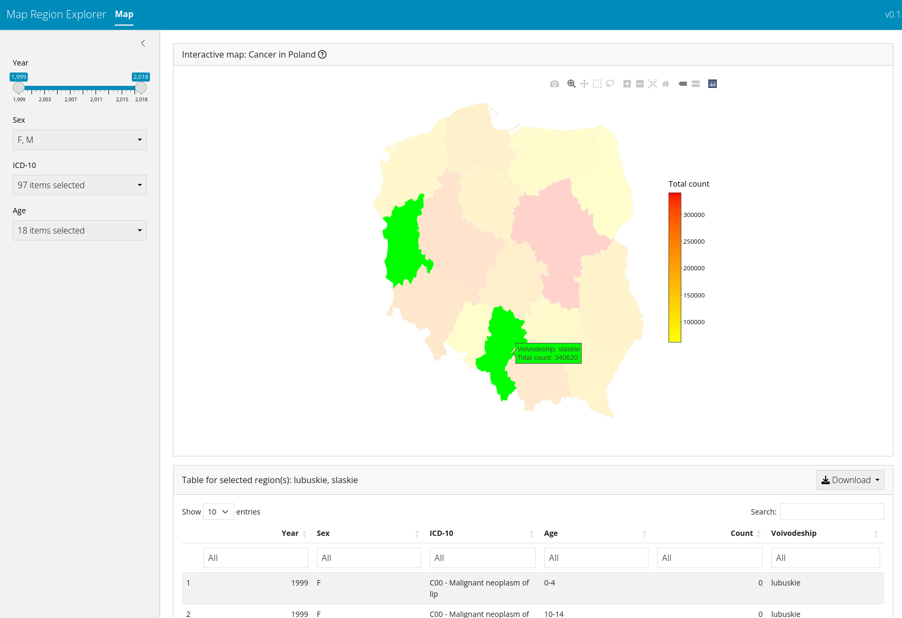

# Map Region Explorer

Generic R/Shiny app for map region data exploration. Main features:
- Config-based input data: supply your own data without any app code modifications
- Interactive map: tooltips, multi-region on-click selection
- Dynamic data filtering



# Minimal data config
```
test_data:
  title: "Dummy data"
  data_dir: "./tests/testthat/data"

  count_data:
    file_details:
      file_name: "test_count_data.csv"
      col_defs:
        region_id: 
          type: "factor"
          label: "Region ID"
        fraction: 
          type: "factor"
          label: "Fraction"
        foo: 
          type: "integer"
          label: "Foo bar"
        count: 
          type: "integer"
          label: "Count"
    count_col: "count"
    location_id_col: "region_id"
    
  location_data:
    file_details:
      file_name: "test_region_data.csv"
      col_defs:
        id: 
          type: "factor"
          label: "Region ID"
        label: 
          type: "factor"
          label: "Region name"
        x: 
          type: "double"
          label: "X"
        "y": 
          type: "double"
          label: "Y"
    id_col: "id"
    label_col: "label"
    x_col: "x"
    y_col: "y"
```
